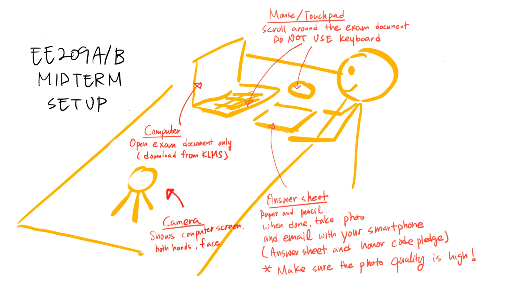

<h1>Guideline for Untact (non-face-to-face) Exam</h1>
<h2 class="ui dividing header">Schedule</h2>

Wednesday (10/21) 9:00 AM - 11:45 AM 

Additional rules

<li>Closed book</li>
<li>No early answer sheet submission (You should stay Zoom until exam end)</li>

<h2 class="ui dividing header">Procedure (Please Follow Step by Step)</h2>
<h3>1. Preparation : Before midterm exam</h3>
You should prepare three things before midterm exam. 
1) Download "Honor Code Pledge" from KLMS, print and sign. 
2) Prepare test environment setting (Check below detail information). 
3) Prepare A4 papers for your answer sheet. DO NOT use reusable paper (e.g., 이면지). 
 

<h3>2. Exam</h3>
1) Setup the test environment  
2) Enter your TA's Zoom link  
   <li>We assigned the test TA for each. Please check the appopriate Zoom link from <a href="../announcements-209A">EE209A</a>, <a href="../announcements-209B">EE209B</a></li>
3) Donwnload exam sheet from KLMS (It will be ready at 9:00 AM)  
4) When the test is started, do not use keyboard. ONLY mouse is allowed during exam.
 
 

<h3>3. Submission guideline (from 11:45 AM - 11:50 AM)</h3>
Keep stay at Zoom and you should submit both 1) Honor Code Pledge and 2) Answer sheets. 
1) Take a photo of both Honor Code Pledge and Answer sheets.  
2) Submit all files via email by using your smartphone
<li> Send email to your test TA. AGAIN, smartphone is only allowed for submission.  (For example, if you entered TA Miryeong Kwon's Zoom link, then you should send email to Miryeong Kwon)</li>
<li> Email title should be [EE209 Midterm] StudentID Name  
(Example: [EE209 Midterm] 20195399 MiryeongKwon)</li>
<li>When TA says "Test is end", then you can exit the Zoom</li>

 

 

<h2 class="ui dividing header">Detail information</h2>
<h3>Environment setup</h3>

 
 